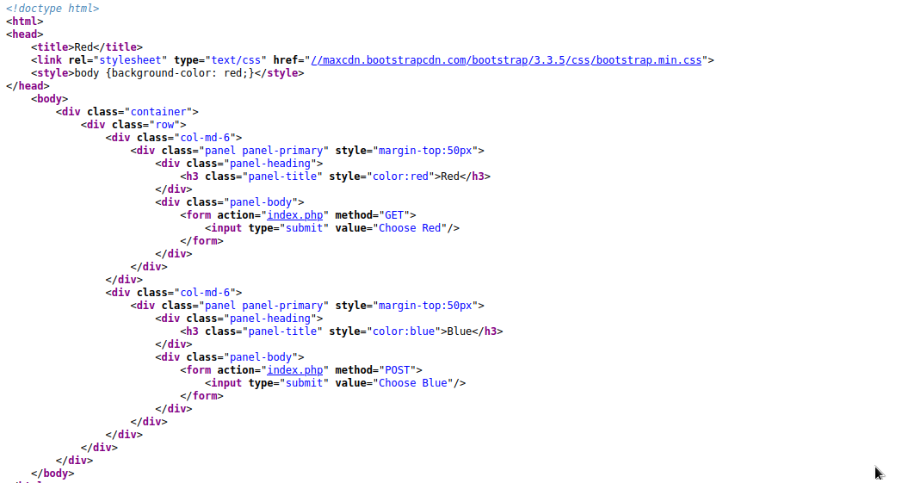
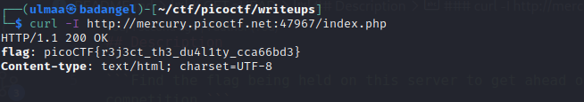

# GET aHEAD

***

## Description

`Find the flag being held on this server to get ahead of the competition`

* http://mercury.picoctf.net:47967/

Даалгаварын нэрийг харвал _GET aHEAD_ буюу http request method-той холбоотой байж болох санаа төрсөн.

<figure><figcaption></figcaption></figure>

_Даалгаварын source code-г харвал **GET** хүсэлтээр улаан өнгийг **POST** хүсэлтээр цэнхэр өнгийг сонгож байсан_

* curl -X POST http://mercury.picoctf.net:47967/ үр дүнд цэнхэр өнгө
* curl -X POST http://mercury.picoctf.net:47967/ үр дүнд улаан өнгө
* curl -X PUT,DELETE http://mercury.picoctf.net:47967/ үр дүнд ямар ч өнгийг харуулсан response ирээгүй.

### curl -I http://mercury.picoctf.net:47967/ HEAD request явуулж үзэхэд амжилттай flag-г олсон

## Дүгнэлт

Энэхүү даалгаварын зорилго нь http request method-н ялгааг харуулах зорилготой
